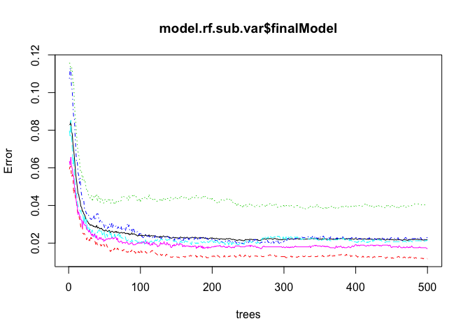

# Quanitifying Exercise Performance using Personal Fitness Tracker Data

###Author : Stephanie Roark

Using devices such as Jawbone Up, Nike FuelBand, and Fitbit it is now possible to collect a large amount of data about personal activity relatively inexpensively. These type of devices are part of the quantified self movement – a group of enthusiasts who take measurements about themselves regularly to improve their health, to find patterns in their behavior, or because they are tech geeks. One thing that people regularly do is quantify how much of a particular activity they do, but they rarely quantify how well they do it. Using data from accelerometers on the belt, forearm, arm, and dumbell, 6 participants were asked to perform barbell lifts correctly and incorrectly in 5 different ways. More information is available from the website here: http://groupware.les.inf.puc-rio.br/har (see the section on the Weight Lifting Exercise Dataset).

In order to predict whether the participant's did the exercise correctly or incorrectly, we must begin by selecting the data relevant to the exercises that we want to predict.


The data captured on the belt, arm, forearm and dumbell are selected as predictors. Additionally, all variables with missing data are excluded.

###Exploratory Data Analysis


```r
classe <- data.train$classe

data.subset <- grepl("belt|arm|forearm|dumbbell", names(data.train))
data.missing <- sapply(data.train[data.subset], function (x) any(is.na(x) | x == ""))
pred.data <- !data.missing
predictors <- names(data.missing)[pred.data]

#create the final data set with the predictor variables and outcome variable
training <- data.frame(classe, data.train[,predictors])
testing <- data.test[,predictors]

# #Create my own test and train sets    
inTrain <- createDataPartition(y=training$classe, p=0.6, list=FALSE)
train <- training[inTrain, ]
test <- training[-inTrain, ]
dim(train)
```

```
## [1] 11776    53
```

```r
dim(test)
```

```
## [1] 7846   53
```

###Cross Validation, Preproccessing and Variance


###Modeling 
Multiple methods are used for creating models for prediction.

####GBM Model
Beginning with Gradient boosting, a method used for regression and classification problems, which produces a prediction model in the form of an ensemble of weak prediction models, typically decision trees. It builds the model in a stage-wise fashion like other boosting methods do, and it generalizes them by allowing optimization of an arbitrary differentiable loss function.


```
## Confusion Matrix and Statistics
## 
##           Reference
## Prediction    A    B    C    D    E
##          A 2194   52    0    0    2
##          B   26 1432   36    3   21
##          C    7   29 1318   50    7
##          D    5    3   13 1219   21
##          E    0    2    1   14 1391
## 
## Overall Statistics
##                                           
##                Accuracy : 0.9628          
##                  95% CI : (0.9584, 0.9669)
##     No Information Rate : 0.2845          
##     P-Value [Acc > NIR] : < 2.2e-16       
##                                           
##                   Kappa : 0.9529          
##  Mcnemar's Test P-Value : 1.876e-10       
## 
## Statistics by Class:
## 
##                      Class: A Class: B Class: C Class: D Class: E
## Sensitivity            0.9830   0.9433   0.9635   0.9479   0.9646
## Specificity            0.9904   0.9864   0.9856   0.9936   0.9973
## Pos Pred Value         0.9760   0.9433   0.9341   0.9667   0.9879
## Neg Pred Value         0.9932   0.9864   0.9922   0.9898   0.9921
## Prevalence             0.2845   0.1935   0.1744   0.1639   0.1838
## Detection Rate         0.2796   0.1825   0.1680   0.1554   0.1773
## Detection Prevalence   0.2865   0.1935   0.1798   0.1607   0.1795
## Balanced Accuracy      0.9867   0.9649   0.9745   0.9707   0.9810
```

The accuracy of the GBM model is 96.3%.

####Rpart:
Next we will examine an Rpart model or Recursive Partitioning and Regression Trees:


```
## Confusion Matrix and Statistics
## 
##           Reference
## Prediction    A    B    C    D    E
##          A 2024  625  644  573  230
##          B   41  515   39  245  188
##          C  161  378  685  468  370
##          D    0    0    0    0    0
##          E    6    0    0    0  654
## 
## Overall Statistics
##                                           
##                Accuracy : 0.4943          
##                  95% CI : (0.4831, 0.5054)
##     No Information Rate : 0.2845          
##     P-Value [Acc > NIR] : < 2.2e-16       
##                                           
##                   Kappa : 0.3388          
##  Mcnemar's Test P-Value : NA              
## 
## Statistics by Class:
## 
##                      Class: A Class: B Class: C Class: D Class: E
## Sensitivity            0.9068  0.33926  0.50073   0.0000  0.45354
## Specificity            0.6309  0.91893  0.78743   1.0000  0.99906
## Pos Pred Value         0.4941  0.50097  0.33220      NaN  0.99091
## Neg Pred Value         0.9445  0.85289  0.88192   0.8361  0.89034
## Prevalence             0.2845  0.19347  0.17436   0.1639  0.18379
## Detection Rate         0.2580  0.06564  0.08731   0.0000  0.08335
## Detection Prevalence   0.5220  0.13102  0.26281   0.0000  0.08412
## Balanced Accuracy      0.7689  0.62910  0.64408   0.5000  0.72630
```

The rpart model has a significantly lower accuracy of 49.4%


```
## Warning: labs do not fit even at cex 0.15, there may be some overplotting
```


####Random Forest
And finally, the Random Forest model which are an ensemble learning method for classification and regression that operate by constructing a multitude of decision trees.


```
## Confusion Matrix and Statistics
## 
##           Reference
## Prediction    A    B    C    D    E
##          A 2231    6    0    0    0
##          B    1 1509   12    0    0
##          C    0    3 1354   24    0
##          D    0    0    2 1261    8
##          E    0    0    0    1 1434
## 
## Overall Statistics
##                                           
##                Accuracy : 0.9927          
##                  95% CI : (0.9906, 0.9945)
##     No Information Rate : 0.2845          
##     P-Value [Acc > NIR] : < 2.2e-16       
##                                           
##                   Kappa : 0.9908          
##  Mcnemar's Test P-Value : NA              
## 
## Statistics by Class:
## 
##                      Class: A Class: B Class: C Class: D Class: E
## Sensitivity            0.9996   0.9941   0.9898   0.9806   0.9945
## Specificity            0.9989   0.9979   0.9958   0.9985   0.9998
## Pos Pred Value         0.9973   0.9915   0.9804   0.9921   0.9993
## Neg Pred Value         0.9998   0.9986   0.9978   0.9962   0.9988
## Prevalence             0.2845   0.1935   0.1744   0.1639   0.1838
## Detection Rate         0.2843   0.1923   0.1726   0.1607   0.1828
## Detection Prevalence   0.2851   0.1940   0.1760   0.1620   0.1829
## Balanced Accuracy      0.9992   0.9960   0.9928   0.9895   0.9971
```

The accuracy of the random forest model is the best at 99.3%, the best of the three models. This value for the accuracy is very good and we should look at the possibility of overfitting.
We can plot the error vs. the number of trees in the random forest model to check for overfitting of the model.


```
## 
## Call:
##  randomForest(x = x, y = y, mtry = param$mtry, allowParallel = TRUE) 
##                Type of random forest: classification
##                      Number of trees: 500
## No. of variables tried at each split: 2
## 
##         OOB estimate of  error rate: 0.83%
## Confusion matrix:
##      A    B    C    D    E  class.error
## A 3346    1    1    0    0 0.0005973716
## B   13 2258    8    0    0 0.0092145678
## C    0   19 2031    4    0 0.0111976631
## D    0    0   41 1886    3 0.0227979275
## E    0    1    1    6 2157 0.0036951501
```

The OOB estimate of the error rate is 0.96%.

The correlation of variables can interfer with the prediction of the models. 


```
## [1] "accel_belt_y"         "classe"               "accel_belt_x"        
## [4] "gyros_belt_z"         "total_accel_dumbbell" "gyros_dumbbell_y"    
## [7] "total_accel_arm"
```

```
## Confusion Matrix and Statistics
## 
##           Reference
## Prediction    A    B    C    D    E
##          A 2231    7    0    0    0
##          B    1 1509   16    0    5
##          C    0    2 1350   27    0
##          D    0    0    2 1258    9
##          E    0    0    0    1 1428
## 
## Overall Statistics
##                                          
##                Accuracy : 0.9911         
##                  95% CI : (0.9887, 0.993)
##     No Information Rate : 0.2845         
##     P-Value [Acc > NIR] : < 2.2e-16      
##                                          
##                   Kappa : 0.9887         
##  Mcnemar's Test P-Value : NA             
## 
## Statistics by Class:
## 
##                      Class: A Class: B Class: C Class: D Class: E
## Sensitivity            0.9996   0.9941   0.9868   0.9782   0.9903
## Specificity            0.9988   0.9965   0.9955   0.9983   0.9998
## Pos Pred Value         0.9969   0.9856   0.9790   0.9913   0.9993
## Neg Pred Value         0.9998   0.9986   0.9972   0.9957   0.9978
## Prevalence             0.2845   0.1935   0.1744   0.1639   0.1838
## Detection Rate         0.2843   0.1923   0.1721   0.1603   0.1820
## Detection Prevalence   0.2852   0.1951   0.1758   0.1617   0.1821
## Balanced Accuracy      0.9992   0.9953   0.9912   0.9883   0.9951
```

```
##  Accuracy 
## 0.9910783
```

The accuracy for the random forest model without the correlated variables is 99.2%.


```
## 
## Call:
##  randomForest(x = x, y = y, mtry = param$mtry, allowParallel = TRUE) 
##                Type of random forest: classification
##                      Number of trees: 500
## No. of variables tried at each split: 2
## 
##         OOB estimate of  error rate: 0.79%
## Confusion matrix:
##      A    B    C    D    E  class.error
## A 3346    0    1    1    0 0.0005973716
## B   13 2262    4    0    0 0.0074594120
## C    0   18 2034    2    0 0.0097370983
## D    0    0   39 1889    2 0.0212435233
## E    0    3    2    8 2152 0.0060046189
```

The OOB estimate of the error rate is 0.83%.

Using the varImp function we can examine variable importance to futher select the best predictor variables for the model.


```
## rf variable importance
## 
##   only 20 most important variables shown (out of 52)
## 
##                   Overall
## roll_belt          100.00
## yaw_belt            81.56
## magnet_dumbbell_z   67.13
## magnet_dumbbell_y   61.42
## pitch_belt          61.00
## pitch_forearm       60.27
## magnet_dumbbell_x   52.62
## roll_forearm        51.30
## magnet_belt_z       46.22
## magnet_belt_y       44.18
## accel_dumbbell_y    42.65
## roll_dumbbell       42.61
## accel_belt_z        41.82
## accel_dumbbell_z    38.94
## roll_arm            36.80
## accel_forearm_x     34.65
## gyros_dumbbell_y    31.07
## accel_arm_x         30.05
## accel_dumbbell_x    28.95
## yaw_dumbbell        28.30
```

The top ten variables from the measure of importance are:


Then we can build a model based on the most important variables. 
A model with the top 6 variables:


```
## 
## Call:
##  randomForest(x = x, y = y, mtry = param$mtry, allowParallel = TRUE) 
##                Type of random forest: classification
##                      Number of trees: 500
## No. of variables tried at each split: 2
## 
##         OOB estimate of  error rate: 2.18%
## Confusion matrix:
##      A    B    C    D    E class.error
## A 3309   15   12    9    3  0.01164875
## B   27 2187   51   11    3  0.04036858
## C    8   19 2007   19    1  0.02288218
## D    6    4   27 1888    5  0.02176166
## E    2   16    8   11 2128  0.01709007
```

Looking at the confusion matrix we see


```
##           Reference
## Prediction    A    B    C    D    E
##          A 2200   22    4    1    2
##          B   15 1465    8    0   15
##          C   11   24 1343   14    2
##          D    4    7   12 1267    7
##          E    2    0    1    4 1416
```

```
##  Accuracy 
## 0.9802447
```

The accuracy for the random forest model including the top 6 variables of importance falls to 97.3%.

Plot of the final model:



The OOB estimate of the error rate is 2.52%.

###Predictions
The predictions on the test set using the both the uncorrelated model and the most important variables models.


```
##  [1] B A B A A E D B A A B C B A E E A B B B
## Levels: A B C D E
```

```
##  [1] B A B A A E D B A A B C B A E E A B B B
## Levels: A B C D E
```

Both models accurately predict the test cases.
